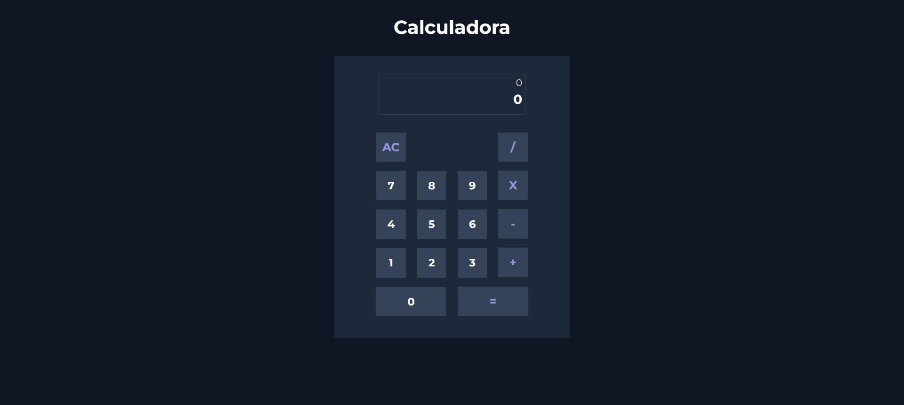

# Calculadora_OOP
Projeto de uma calculadora totalmente Orientada a Objetos

## Tecnologias usadas
HTML |
CSS |
JavaScript

### Funcionalidades
>- Cálculos simples 
>- Pode ser usado mais de uma operação
>- Regras matemáticas respeitas

### Link do projeto
[Calculadora](https://willian-97.github.io/Calculadora_OOP/)